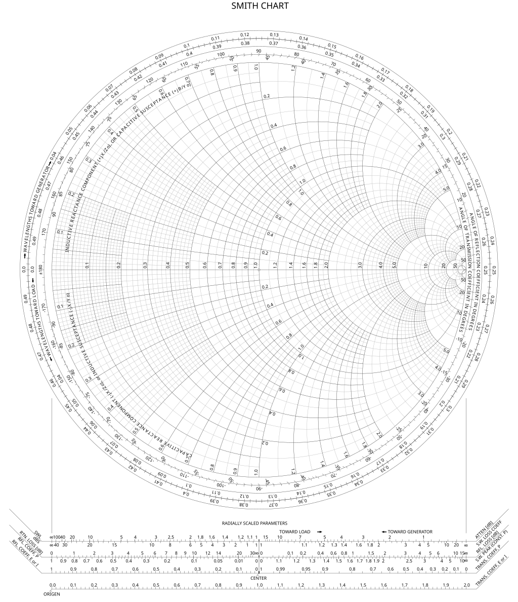

# 📊 Interactive Smith Chart Tool

A powerful, interactive web application for creating, manipulating, and exporting Smith Charts - an essential tool for RF, microwave engineering, and electrical engineering professionals and students.



## ✨ Features

- **Interactive Smith Chart**: Fully interactive Smith chart with zoom and pan capabilities
- **Professional Drawing Tools**: Create precise lines, circles, arcs, and text annotations
- **Advanced Object Manipulation**: Select, move, rotate, and resize elements with ease
- **Style Customization**: Personalize with colors, line widths, and line styles
- **Export Options**: Save your work as high-quality PNG or PDF files
- **Responsive Design**: Works on desktop and tablet devices

## 🚀 Quick Start

### Prerequisites
- [Node.js](https://nodejs.org/) (v14 or higher)
- npm (included with Node.js)

### Installation

```bash
# Clone the repository
git clone https://github.com/yourusername/SmithChartApp.git

# Navigate to the project directory
cd SmithChartApp

# Install dependencies
npm install

# Start the server
npm start
```

Then visit `http://localhost:3000` in your browser.

## 💻 Usage

1. **Select a Drawing Tool** from the toolbar (Line, Circle, Arc, Text)
2. **Create Elements** by clicking and dragging on the Smith Chart
3. **Customize Appearance** using the style controls panel
4. **Select and Modify** existing elements with the selection tool
5. **Export Your Work** as a PNG image or PDF document

## 🔧 Technologies

- **Frontend**: HTML5, CSS3, JavaScript
- **Canvas Manipulation**: [Fabric.js](http://fabricjs.com/)
- **PDF Export**: [jsPDF](https://github.com/parallax/jsPDF)
- **Server**: Node.js with Express

## 📚 For Educators

This tool is perfect for classroom demonstrations and assignments related to:
- Impedance matching
- Transmission line theory
- RF circuit design
- Antenna design

## 🤝 Contributing

Contributions are welcome! Please feel free to submit a Pull Request.

## 📝 License

This project is licensed under the MIT License - see the LICENSE file for details.

---

Built with ❤️ for the electrical engineering community